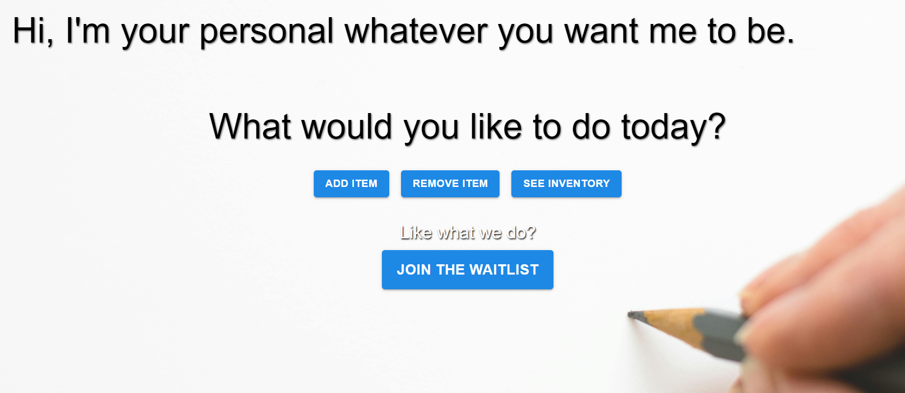
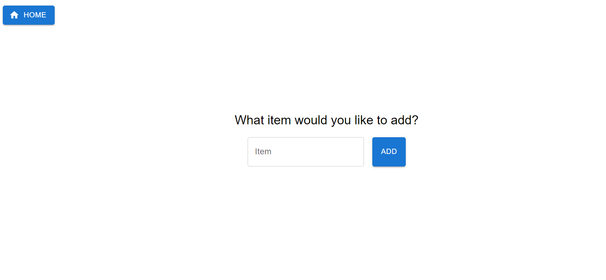
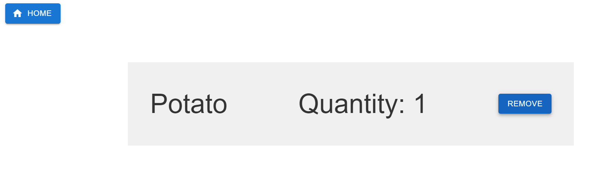
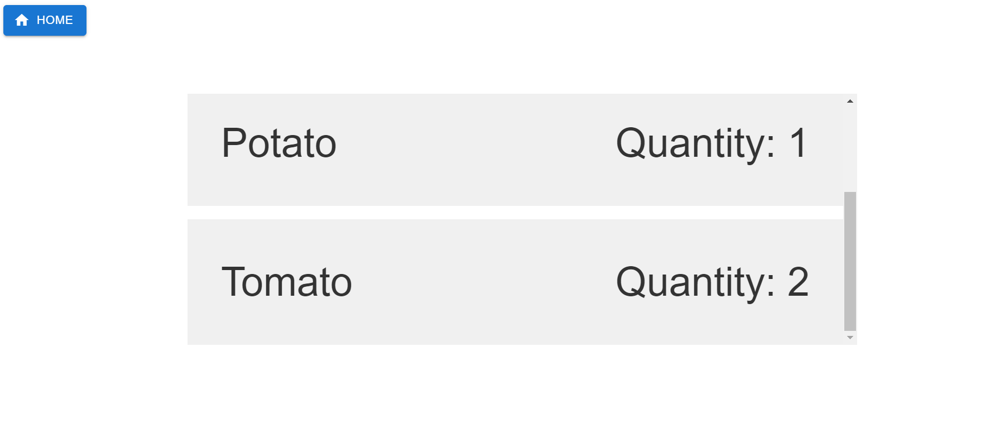

# Inventory Tracker

Welcome to the Inventory Tracker! This website helps users manage their personal inventory, grocery list, shopping cart, and more. The site is designed to be flexible and cater to various inventory management needs.

## Features

- **Add Items**: Easily add items to your inventory.
- **Remove Items**: Remove items from your inventory with a click.
- **View Inventory**: See a list of all items in your inventory.
- **Join Waitlist**: If you like what we do, you can join the waitlist to become a user.

## Website Access

You can access the website [here](https://inventory-tracker-nu-two.vercel.app/).

## Getting Started

To start using the Inventory Tracker, follow these simple steps:

1. Visit the [website](https://inventory-tracker-nu-two.vercel.app/).
2. Use the buttons on the main page to add, remove, or view inventory items.
3. If you don't have an account, you can join the waitlist to become a user.

## Screenshots

### Welcome Page

### Add Item

### Remove Item

### View Inventory

## Development

This project uses Firebase for backend services, Next.js for the frontend and deployed on Vercel. 
